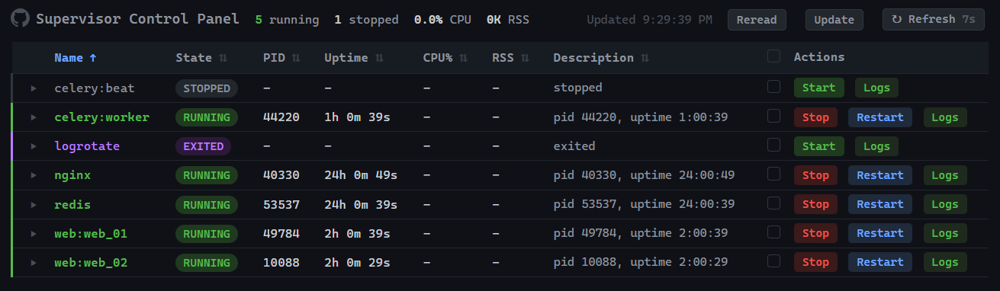

# Supervisor Control Panel

A web-based dashboard for monitoring and controlling [Supervisor](http://supervisord.org/) processes. Also provides a `/metrics` endpoint for Prometheus scrapers.



## Requirements

- Python 3.10+
- [uv](https://github.com/astral-sh/uv) (package manager)
- A running `supervisord` instance with a Unix socket

## Installation

```bash
uv sync
```

## Usage

```bash
python main.py [options]
```

| Option | Default | Description |
|---|---|---|
| `--socket PATH` | `/tmp/supervisor.sock` | Path to Supervisor Unix socket |
| `--port PORT` | `8000` | Port to listen on |
| `--host HOST` | `0.0.0.0` | Host to bind to |
| `--cpu-interval SECONDS` | `1.0` | CPU sampling interval |

**Example:**

```bash
python main.py --port 8000 --socket /var/run/supervisor.sock
```

Then open `http://localhost:8000` in your browser.


## Prometheus Metrics

The `/metrics` endpoint exposes per-process gauges labeled by `name`:

- `supervisor_process_up` — 1 if RUNNING, 0 otherwise
- `supervisor_process_cpu_percent` — CPU usage %
- `supervisor_process_rss_bytes` — Resident memory in bytes
- `supervisor_process_swap_bytes` — Swap usage in bytes
- `supervisor_process_uptime_seconds` — Process uptime in seconds
